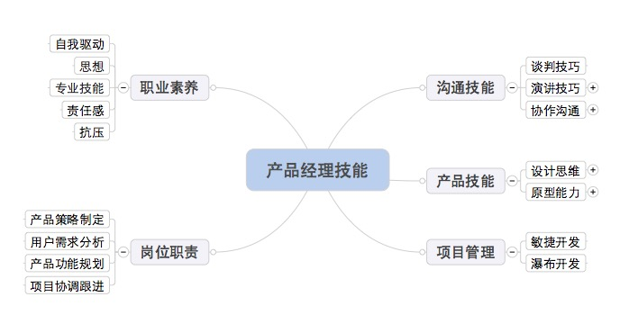
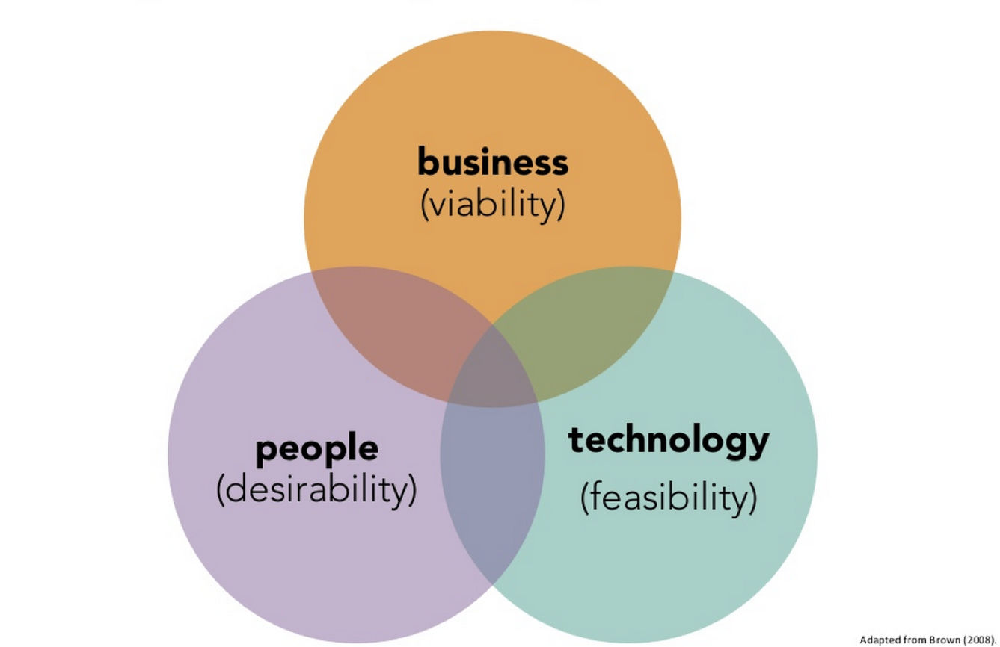

# 产品经理必修课
## 说明
产品经理这个词越来越热门，但是每家公司每个人对产品经理定义不一样、门槛也不一样、人也良莠不齐。而我更愿意相信只有脚踏实地前行，才能在这个岗位上获得专业的认可。本项目是我工作中的学习与积累，我希望这些经验分享给更的人。如果你有相同想可以一同加入到这个项目中来共同进步。




从三个方向进行延展：

  * [产品技能(Product)](./product/)
  * [沟通技能(Communication)](./communication/)
  * [项目管理(Project)](./project/)
  
目录结构：

```
   --root
      |-- procduct          //产品技能
      |-- communication     //沟通技能
      |-- project           //项目管理

```

## 产品技能

产品技能按照DesignThinking分为三部分进行展开：

  * [技术可行性](./product/technology/)
  * [人的需求性](./product/people/)
  * [商业的可行性](./product/business/)




## 沟通技能

##


## 拓展阅读资料
[百度云̵](http://pan.baidu.com/s/1qWsWnj2)